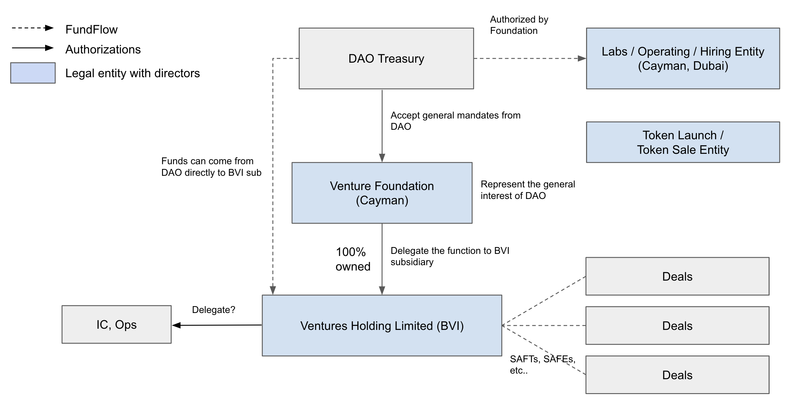

# DAO Legal Structuring

_Updated 220610_

_This document is intended for general information and discussion only. It is not a full analysis of the matters discussed and may not be relied upon as legal or other professional advice. The information contained herein may be subject to future change due to the evolving nature of the laws and regulations relating to DAOs and crypto assets generally and we do not intend to update this document to reflect such changes. Each project’s legal structuring should be customized to the specific activities of the organization. This document may not be suitable for each project's specific circumstances. The legal recognition of DAOs differs between jurisdictions and you should always seek advice from licensed attorneys in the relevant jurisdiction. There is no “one size fits all”, and likely there are no “right answers” as this is a new industry with limited statutory or case law._

## DAO’s Project Activities

A DAO, although a decentralized community, from time to time needs to deal with “real world” assets or legal entities. Depending on the proposed objective and activities of each project, you may need to set up one or more legal entities for each project. The table below sets forth some of the activities that a DAO may want to do and why a legal structure is required under different circumstances. You should always consult your legal and tax advisors regarding the setup of the legal entities and the potential legal, tax and other implications.

| Activity                      | Why Legal Structure                                        | Trad Incentives            |
| ----------------------------- | ---------------------------------------------------------- | -------------------------- |
| Venture and other Investments | Sign SAFTs, SAFEs and other legal documents; Bank accounts | Fund incentive: 2/20 carry |
| Labs, Operations              | Talent recruitment; Bank account; Hold IP interests        | Equity; Token earnouts     |
| Token Sales                   | Sign sale docs; KYC/AML procedures                         |                            |

## Typical Legal Structure

The diagram below shows a typical legal structure for a DAO project which mainly focuses on activities outside of the US.

The main advantage of a Cayman Foundation Company is the flexibility of the structure. There is a wide scope to tailor the constitutional documents of a Foundation to the needs and objectives of DAOs. Further, a Foundation does not need to have shareholders meaning that the entity exists without beneficial owners for the furtherance of its purposes. This is an attractive feature for DAOs which are not designed with “ownership” and profit at the forefront.

The British Virgin Island (BVI) is also attracting many DAOs to have operational entities there. A typical structure is to set up a BVI subsidiary of a Cayman Foundation so that the DAOs can take advantage of the benefits of each relevant jurisdiction. IC or board members could sit at the BVI or Cayman Foundation level or simply act for the interest of the DAO like OrangeDAO.

## Principles

#### Prioritizing Execution over Ideology

DAOs can set up various legal structures, including traditional corporations, techstacks, boards and centralized committees, to enable the project teams to transact and make investments in the real world. The project team shall focus on the fast setup of the legal structure and operations, with a view to decentralize and automate over time.

#### Foundation Constitutional Documents Aligned with DAO Mandate

The Foundation constitutional documents would govern the relationship between the DAO and the Foundation. When drafting the Foundation constitutional documents, the project team needs to consider the following questions:

(i) What are in scope and out of scope activities?

(ii) How are directors/committee members selected and replaced? and

(iii) What are the rules and procedures for the decision making?

#### Jurisdiction Diversity

By its nature, activities relating to DAOs and digital assets are “global” and are likely not focused on any particular jurisdiction. Therefore, defaulting to “setup Delaware” may not be an efficient legal structure for DAO projects. To the extent that activities are performed outside of the US, the legal setup should generally also be in a non-US jurisdiction.

#### Driven by Incentives

In order to incentivize the contributors and retain top talent for DAO’s venture, asset management, research and product development and other projects, the DAO needs to design a competitive compensation mechanism. A typical compensation system may be derived from the traditional incentive models for venture funds and projects. For instance, the project team could earn carry interest for their investments or receive a share of equity interest or token earnings for early stage product development.

#### Isolate Risks and Activities

Each entity has specialized activities and compliance requirements, and should be kept separate where possible, particularly the entity undertaking the token creation and sale. Token creation and sale may involve risks that are different from the risks involved in the operation of the DAO. Therefore, to the extent possible, it is desirable to set up a separate entity to do the token creation and sale (and not commingle this activity with the activities of the operating and hiring entities).

#### Compliance

The project team should obtain advice in relation to AML and other compliance matters in all relevant jurisdictions prior to any offering and conduct all necessary AML and compliance checks for the fundraising and token offering in accordance with applicable law and/or best practice.

## How to Structure the Cayman Foundation

In order to connect the DAO to the Foundation, the governing documents of the Foundation may include provisions that require the director(s) and the supervisor to take into account the decisions of the DAO, subject to applicable law and their fiduciary duties. These DAO decisions will take the form of “recommendations”. Such “recommendations” may provide that directors and/or a supervisor be nominated by a majority resolution passed by the token holders on the DAO (although the actual appointment of such director or supervisor would be undertaken by the Foundation itself, in accordance with its constitutional documents). The objects of the Foundation should be drafted generally such that the Foundation acts for the benefit of, but not on behalf of or as agent to, the DAO or the DAO committee.

#### Delegation

Sometimes it is time consuming and inconvenient to ask the director to follow the “recommendations” passed by the whole community voting process. There can be a concept of an advisory committee to be built in to make the daily operation more efficient.

- The committee is entitled to provide “committee recommendations” to the Foundation.
- The memorandum and articles of association of the Foundation may require that the directors and the supervisor consider and, if possible and appropriate having due consideration to the objects of the Foundation, implement the “recommendations” made by the committee or DAO resolutions (which can attach the Snapshot link) subject to all applicable law and fiduciary duties.
- The selection and governance of the committee still remain as a matter for the DAO itself.
- The directors of the Foundation should retain power and discretion as to how the assets of the Foundation are used.

The members of the committee can also act as directors, officers or authorized signatories of the BVI subsidiary and can also be the holders of the Multisig wallet of the DAO. The committee members and the wallet address held by them can be identified in the launch resolution of the Foundation.

The resolutions of the directors or the committee may be passed by a simple majority vote or more restrictively, by ALL directors and/or committee members.

#### Fund Flow

- The recommended order of operations is that the DAO will make a gratuitous grant of crypto assets to the Foundation, which then passes them down to its BVI subsidiary (whether as further gratuitous grant, or a capital injection, or some other arrangement). This transaction should be appropriately recorded and documented from a legal and accounting perspective.
- If the Foundation does not have its own wallet, the Foundation may direct the DAO (or the relevant committee) to make the transfer of the cryptoassets directly to the BVI subsidiary, on behalf of the Foundation.

## Notes Regarding Token Offering

Regardless if you have a legal opinion regarding the status of the tokens, the recommendation is to try to offer the tokens under the highest standard of exemptions according to the US securities law, i.e under Reg S or Reg D or other exemptions, and securities laws of other relevant jurisdictions.

Take the US securities law as an example, the key considerations include:

- Avoid public solicitation (or no direct selling efforts) in the US.
- Limited to institutional investors or non-US persons in an offshore transaction.
- Beware of publicity restrictions and rules regarding press release, conference or other social media guidelines.
- Check transaction documents by outside US counsel.
- Consider whether the DAO could be an unregistered investment company if the tokens are offered to US investors.

## DAOs With Operations in the US

If the DAO or the project team want to conduct transactions or operate in the US, you should always consult with your legal and tax advisors in order to find an appropriate legal structure. This document does not pertain to provide a comprehensive analysis regarding the potential legal, tax and regulatory issues for the DAO or the project team to operate in the US. It is merely focused on the legal structure and the major tax concerns.

Generally, it is not recommended to place any top-level entities in the US as the whole group of entities underneath the US entity will likely fall under US tax jurisdiction (e.g., US has onerous international tax rules, such as controlled foreign corporations, passive foreign investment company, and inversion rules, that would subject the entire group to US taxes) and other purposes. Because the US tax classification of a DAO is still unsettled, there is a risk that the investors of the DAO could be subject to US tax if the DAO has any activities or transactions that create a US tax nexus or US source income (e.g. staking or mining in the US). To mitigate such risks, you can consider using a US corporation (or a US LLC that elects to be treated as a corporation for US tax purposes) to house any employees, activities, transactions, or operations in the US. You can also use foreign entities that are treated as corporations for US tax purposes but would likely run into more burdensome tax compliance issues such as getting an EIN, making payroll tax deposits, withholding taxes, etc. Again, please consult with your US tax advisor regarding the risks of creating a US tax nexus or generating US source income since the analysis is very fact-specific.

As a general note, the US tax rules regarding crypto assets are generally unsettled. There is some guidance released by the IRS (e.g., the [FAQ](https://www.irs.gov/individuals/international-taxpayers/frequently-asked-questions-on-virtual-currency-transactions) on cryptocurrency and [Notice 2014-21](https://www.irs.gov/pub/irs-drop/n-14-21.pdf)) but does not answer many of the hard questions. But, one thing is certain, the taxation of crypto assets is one of the top priorities of the IRS. In 2021, the IRS launched “Operation Hidden Treasure” which is comprised of agents who are trained in crypto assets and virtual currency tracking, and who are focused on taxpayers who omit crypto assets income from their tax returns. This operation is a partnership between two IRS internal divisions, the Office of Fraud Enforcement and the Criminal Investigation unit, designed to root out tax evasion from crypto asset owners. Lastly, the OECD has also introduced a draft crypto asset reporting framework.

It may help the jurisdiction and tax analysis if the majority of the directors or committee members are outside of the US and distributed across jurisdictions (particularly popular jurisdictions include Singapore, HK, EU, Puerto Rico, or UK territories). If any of the directors or committee members are US citizens, green card holders, or residents (regardless if they’re located in the US), they should consult their own tax (including FATCA) advisors regarding their participation (or ownership) in the Foundation or the BVI subsidiary.

If the project team plans to hire employees in the US, due consideration must be given to US laws (e.g., tax, employment, securities, etc) to mitigate any legal/tax risks. For example, if not properly structured, vesting of equity interest could have a detrimental tax impact on the US employees if the underlying equity interest appreciated in value significantly but is not yet liquid (i.e., cannot be easily sold for cash).

## Contributors

Li Han and Rachel Wang from Mirana Ventures;

[Harold Tin](https://www.nortonrosefulbright.com/en-hk/people/122853) and [Ying Yeo](https://www.nortonrosefulbright.com/en-hk/people/134946) from Norton Rose Fulbright;

[Brad Kruger](https://www.ogier.com/people/bradley-kruger), [Chris Wall](https://www.ogier.com/people/chris-wall) and [Michael Robinson](https://www.ogier.com/people/michael-robinson) from Ogier (Cayman Islands);

[Michael Killourhy](https://www.ogier.com/people/michael-killourhy) and [David Mathews](https://www.ogier.com/people/david-mathews) from Ogier (British Virgin Islands);

[Timmoney Ng](https://www.linkedin.com/in/timmoney-ng-b25b0163/) from Butler Snow (Singapore);

[Chris Page](https://www.conyers.com/people/view/christopher-j-r-page/) from Conyers (Hong Kong).

## References

| Type of reference                              | Links                                                                                                                                                                                                                                                                                      |
| ---------------------------------------------- | ------------------------------------------------------------------------------------------------------------------------------------------------------------------------------------------------------------------------------------------------------------------------------------------ |
| OrangeDAO (Charter) https://www.orangedao.xyz/ | 
Permissioned DAO members (institutional investors), legal fund entity, legal operating entity, 2/20 carry for GPs, future direction to tokenize GP shares. Drawio of OrangeDAO  Structure: https://drive.google.com/file/d/1rNUvoMw3bN-NhZrt6VN-HQcFSKfyZtQr/view?usp=sharing
 |
| References from local legal firms              | 
Ogier https://www.ogier.com/publications/defi-daos-and-vasps-in-the-cayman-islands

https://www.ogier.com/publications/crypto-currency-and-icos-in-the-british-virgin-islands

Conyers https://www.conyers.com/publications/view/a-foundation-for-fintech/
                |
